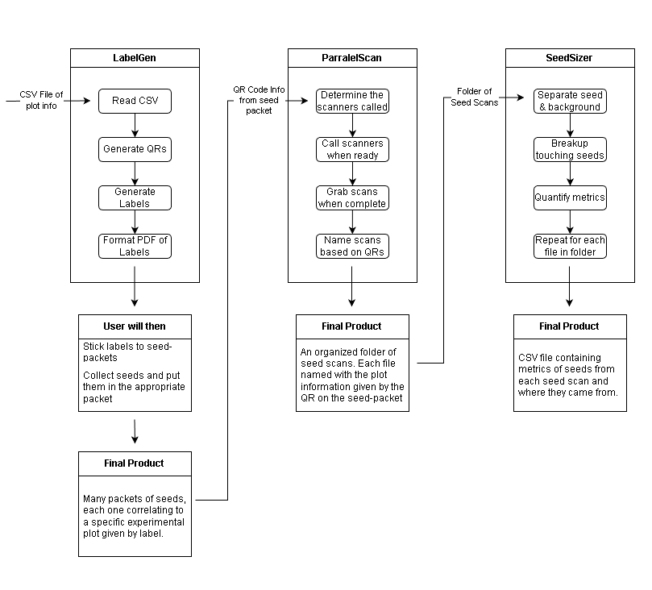

# Seed Pipeline Source Repo



## Context

While working at Vogel Plant Pathology, we worked with multiple field plots,
each containing a specific plant experiment. To evaluate overall success,
we measure both plant growth and final seed yield.

This pipeline is designed to make the latter as efficient as possible.

While intended to work sequentially, each part of the pipeline can be used
independently if only a specific stage is needed.


## General Steps To Use Pipeline

```
        LabelGen            PIPELINE PART 1
            ↓
     Seed Collection
            ↓
    Parallel-Scanning       PIPELINE PART 2
            ↓
        SeedSizer           PIPELINE PART 3
            ↓
   Quantitative Metrics
            ↓
  Determine crop success
```

## Pipeline Components

- LabelGen  
  https://github.com/JeffLepp/LabelGen  
  Sample labeling and metadata encoding

- Parallel-Scanning  
  https://github.com/JeffLepp/Parallel-Scanning  
  High-throughput, parallel flatbed scanning

- SeedSizer  
  https://github.com/JeffLepp/SeedSizer  
  Image-based seed phenotyping and metric extraction

